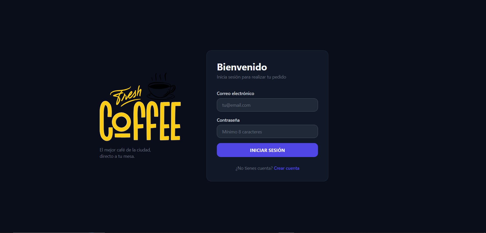
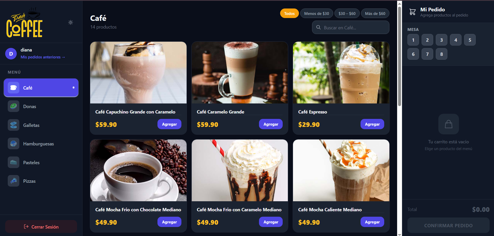
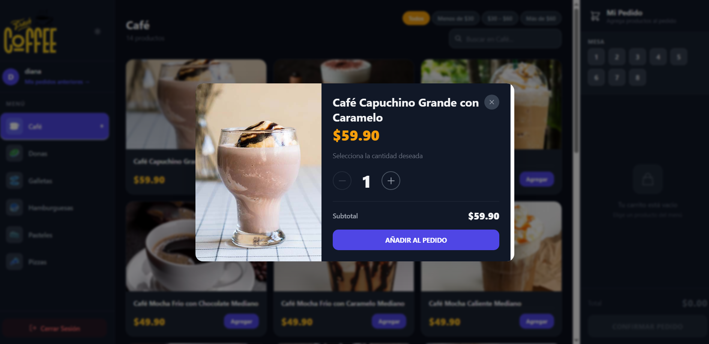
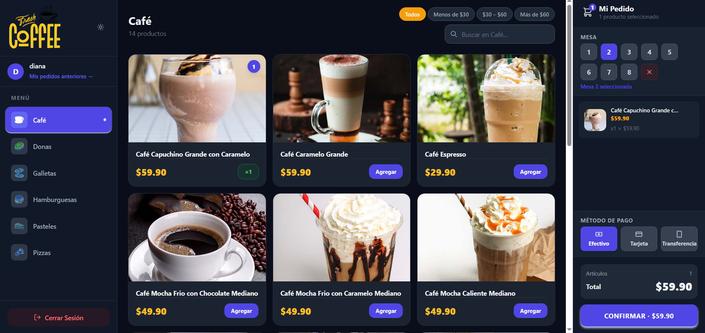
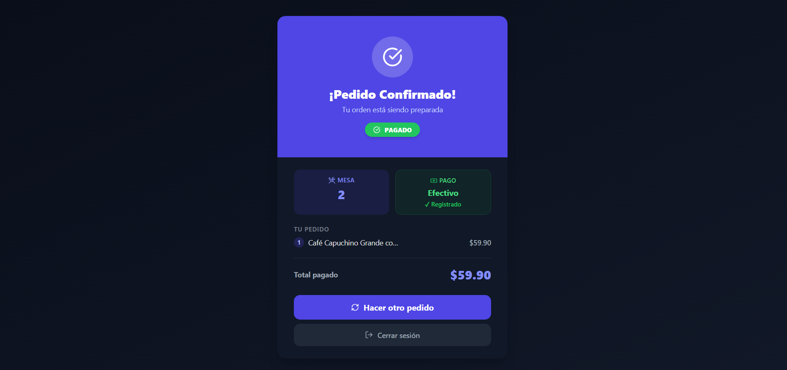
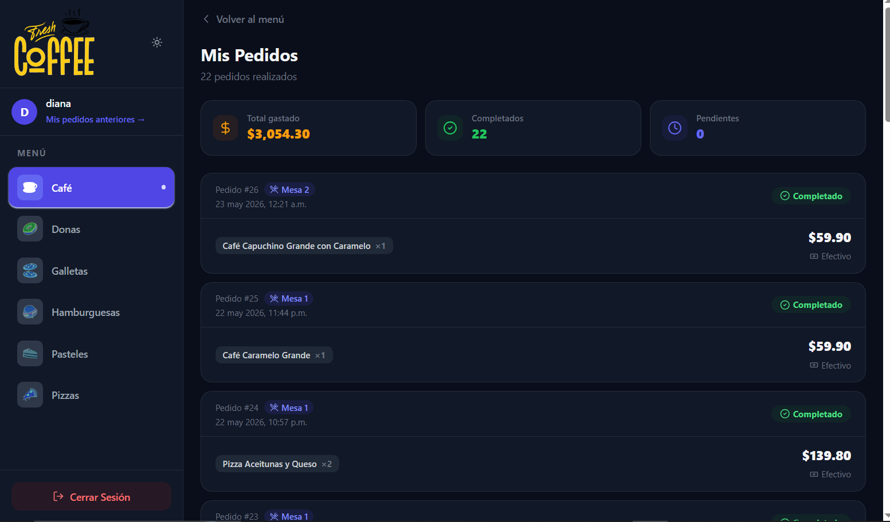
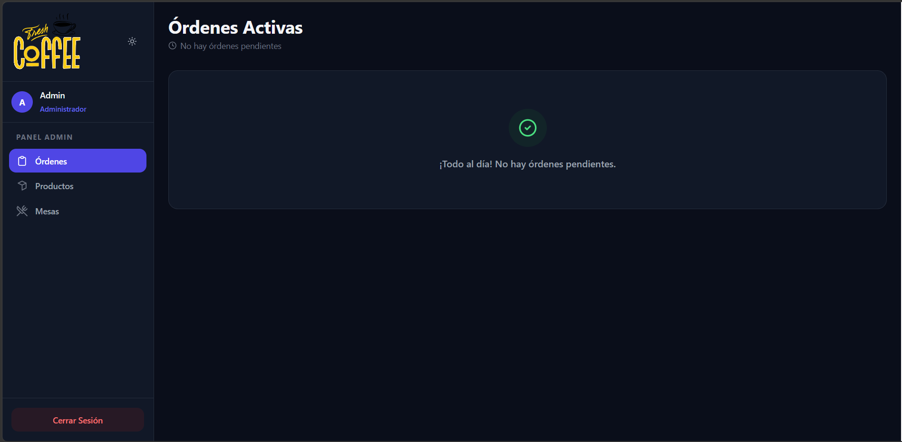
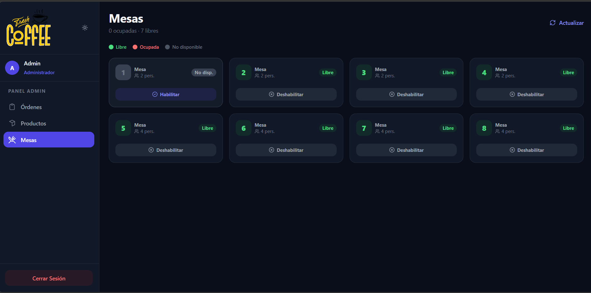
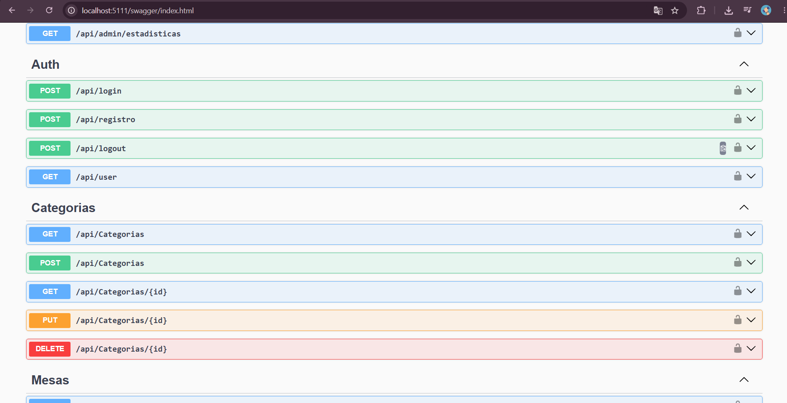
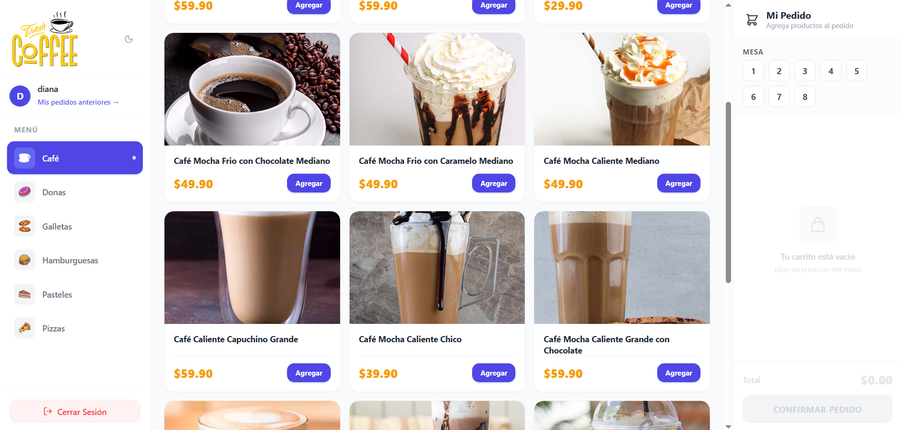

<h1 align="center">☕ Fresh Coffee — Sistema de Gestión de Quiosco Cafetería</h1>

<p align="center">
  
</p>

<p align="center">
  
  
  
  
  
</p>

<p align="center">
  Proyecto Final — Desarrollo Backend con .NET y C# Nivel Intermedio<br/>
  <strong>Estudiante:</strong> Luis Fernando Angulo Heredia (LFAH) &nbsp;|&nbsp;
  <strong>Docente:</strong> Lic. Ing. Limber Mamani Canaza<br/>
  <strong>Institución:</strong> Posgrado UPEA
</p>

---

## 📋 Descripción

Sistema web full-stack para la gestión de una cafetería. Permite a los usuarios registrar pedidos por categoría de producto, asignar mesas y registrar el método de pago. Los administradores cuentan con un panel para gestionar mesas, monitorear órdenes en tiempo real y consultar estadísticas del negocio.

---

## 🖼️ Capturas del Sistema

### 🔐 Login


### 🛒 Vista Principal del Quiosco


### ➕ Modal de Producto


### 🧾 Resumen del Pedido


### ✅ Confirmación de Pago


### 📜 Mis Pedidos


### 🍽️ Panel Admin — Órdenes


### 🪑 Panel Admin — Mesas


### 📄 Documentación Swagger


### ☀️ Modo Claro


---

## 🏗️ Arquitectura N-Capas

```
┌─────────────────────────────────────┐
│           Controllers               │  ← Recibe peticiones HTTP
├─────────────────────────────────────┤
│        Services (+ Interfaces)      │  ← Lógica de negocio
├─────────────────────────────────────┤
│      Repositories (+ Interfaces)    │  ← Acceso a datos
├─────────────────────────────────────┤
│    Entity Framework Core + Npgsql   │  ← ORM
│           PostgreSQL                │  ← Base de datos
└─────────────────────────────────────┘
```

---

## 🗄️ Modelo de Base de Datos

| Tabla | Descripción |
|---|---|
| `users` | Usuarios con flag `admin` para control de roles |
| `categorias` | Categorías del menú (Café, Pizza, Donas…) |
| `productos` | Productos con precio, imagen y disponibilidad |
| `mesas` | Mesas del local con número y capacidad |
| `pedidos` | Pedidos con FK a usuario y mesa (nullable) |
| `pedido_productos` | Detalle de productos por pedido (tabla pivot) |
| `pagos` | Registro de cobro por pedido (1:1) |

---

## 🚀 Tecnologías

### Backend
| Tecnología | Versión |
|---|---|
| ASP.NET Core Web API | 8.0 |
| Entity Framework Core | 8.0 |
| Npgsql (PostgreSQL) | 8.0 |
| AutoMapper | 12.0 |
| JWT Bearer Auth | 8.0 |
| Swashbuckle (Swagger) | 6.6 |
| BCrypt.Net | 4.0 |

### Frontend
| Tecnología | Versión |
|---|---|
| React | 18 |
| Vite | 5 |
| Tailwind CSS | 3.2.4 |
| React Router | 6 |
| SWR | 2.2 |
| Axios | 1.6 |
| Lucide React | latest |

---

## ⚙️ Instalación y Configuración

### Requisitos previos
- [.NET 8 SDK](https://dotnet.microsoft.com/download/dotnet/8.0)
- [Node.js 18+](https://nodejs.org/)
- [PostgreSQL 16](https://www.postgresql.org/)

### 1. Clonar el repositorio
```bash
git clone https://github.com/luisfernandoAngulo28/Sistema-de-Gesti-n-de-Quiosco-Cafeter-a-Fresh-Coffee-.git
cd Sistema-de-Gesti-n-de-Quiosco-Cafeter-a-Fresh-Coffee-
```

### 2. Configurar el Backend
```bash
cd QuioscoAPI
```

Copiar el archivo de configuración y completar con tus datos:
```bash
cp appsettings.example.json appsettings.json
```

Editar `appsettings.json`:
```json
{
  "ConnectionStrings": {
    "DefaultConnection": "Host=localhost;Port=5432;Database=BDQuiosco;Username=postgres;Password=TU_PASSWORD"
  },
  "Jwt": {
    "Key": "TuClaveSecretaMuyLargaDeAlMenos32Caracteres!",
    "Issuer": "QuioscoAPI",
    "Audience": "QuioscoClient"
  }
}
```

Aplicar migraciones y correr el backend:
```bash
dotnet ef database update
dotnet run
```

La API quedará disponible en: `https://localhost:7xxx` y `http://localhost:5xxx`  
Swagger UI: `http://localhost:5xxx/swagger`

### 3. Configurar el Frontend
```bash
cd react-quiosco
npm install
npm run dev
```

El frontend quedará disponible en: `http://localhost:5173`

### 4. Crear usuario administrador
1. Registrarse en `http://localhost:5173/registro`
2. Ejecutar en PostgreSQL:
```sql
UPDATE users SET admin = true WHERE email = 'tu@email.com';
```

---

## 📡 Endpoints Principales

| Método | Ruta | Auth | Descripción |
|---|---|---|---|
| POST | `/api/auth/registro` | No | Registrar usuario |
| POST | `/api/auth/login` | No | Login → JWT |
| GET | `/api/categorias` | No | Listar categorías |
| GET | `/api/productos` | No | Listar productos |
| GET | `/api/mesas` | Sí | Mesas con estado de ocupación |
| POST | `/api/pedidos` | Sí | Crear pedido |
| GET | `/api/pedidos` | Sí | Pedidos (relacional — 5 tablas) |
| POST | `/api/pagos` | Sí | Registrar pago |
| GET | `/api/admin/estadisticas` | Admin | Estadísticas del negocio |

> Documentación completa interactiva disponible en `/swagger`

---

## 📐 Convención de Nombres

Todas las clases e interfaces llevan las iniciales **LFAH** al final:

```
MesaDtoLFAH           CreatePedidoDtoLFAH
IMesaRepositoryLFAH   MesaRepositoryLFAH
IMesaServiceLFAH      MesaServiceLFAH
MappingProfileLFAH    ExceptionMiddlewareLFAH
```

> Los métodos NO llevan iniciales: `GetAll()`, `Create()`, `Delete()`

---

## 📁 Estructura del Proyecto

```
📦 Proyecto Caferia
 ├── 📂 QuioscoAPI/                  ← Backend ASP.NET Core
 │    ├── Controllers/               ← 8 controladores
 │    ├── Services/Interfaces/       ← 7 interfaces de servicio
 │    ├── Repositories/Interfaces/   ← 6 interfaces de repositorio
 │    ├── Models/                    ← 7 modelos de datos
 │    ├── DTOs/                      ← 15+ DTOs con sufijo LFAH
 │    ├── Mapping/                   ← MappingProfileLFAH
 │    ├── Middleware/                ← ExceptionMiddlewareLFAH
 │    ├── Data/                      ← DbContext + DataSeeder
 │    ├── Migrations/                ← 3 migraciones EF Core
 │    └── Program.cs                 ← DI, JWT, CORS, Swagger
 │
 ├── 📂 react-quiosco/               ← Frontend React 18
 │    ├── src/
 │    │    ├── context/              ← QuioscoProvider (estado global)
 │    │    ├── hooks/                ← useQuiosco, useDarkMode, useAuth
 │    │    ├── layouts/              ← Layout, AdminLayout
 │    │    ├── views/                ← Inicio, Ordenes, AdminMesas…
 │    │    └── components/           ← Sidebar, Resumen, Producto…
 │    └── public/img/                ← Imágenes de productos
 │
 ├── 📂 imagenes/                    ← Capturas del sistema
 ├── 📄 diagramadeclases.puml        ← Diagrama UML (PlantUML)
 ├── 📄 diagramadeclases_EA.xml      ← Diagrama para Enterprise Architect
 └── 📄 informe.md                   ← Informe técnico completo
```

---

## ✨ Características Destacadas

- 🌙 **Modo oscuro** completo con persistencia en `localStorage` y sin flash al cargar
- 🔐 **JWT + Roles** — claim `admin` para proteger endpoints de administración
- 🗺️ **AutoMapper** con campos calculados (ej: `Ocupada` en mesas)
- 📦 **GET Relacional** — un solo endpoint retorna datos de 5 tablas joinadas
- 📝 **Swagger documentado** con `/// <summary>`, tags por módulo y response types
- 🛡️ **Middleware global** de manejo de excepciones
- 🌱 **Data Seeder** — categorías y productos cargados automáticamente al iniciar

---

## 👨‍💻 Autor

**Lic. Ing. Luis Fernando Angulo Heredia**  
Posgrado UPEA — Desarrollo Backend con .NET y C# Nivel Intermedio  
Docente: Lic. Ing. Limber Mamani Canaza  
Mayo 2026
